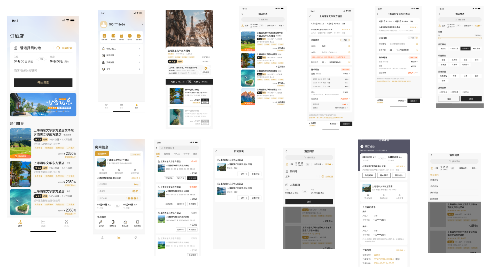

# 无人自助酒店用户端app
## 项目简介
本项目是一个无人自助酒店用户端app(小程序)，用户可以通过app预定酒店房间，入住酒店房间，办理入住，一键开门，退房等操作。
## 项目说明
完整的项目由四部分组成，分别是用户端app(小程序)，酒店管理商家端app(小程序)，后台管理系统(网页)，酒店一体机系统。
功能：
- 用户端app(小程序)：用户可以通过app预定酒店房间，入住酒店房间，办理入住，一键开门，退房，房间打扫，退房提醒等操作。
- 酒店管理商家端app(小程序)：酒店管理人员可以通过app管理酒店房态，查看订单，修改订单信息，退房，退押金，房价修改，一键开门，收益走势与结算等操作。
- 后台管理系统(网页)：对用户、酒店、订单、门锁、公安系统模块管理等。
- 酒店一体机系统：酒店一体机系统是一个硬件设备，可以用于办理入住，退房，续房， 一键开门等操作。
  本项目开源的是用户端app(小程序)的部分。其他部分暂不开源，如对项目感兴趣或者想完整体验请私聊我🛰️EnigmaGuest,备注来来源github。
## 项目技术栈
使用uniapp cli方式进行开发，vue2版本。
## 项目运行
参考[uniapp官方文档](https://uniapp.dcloud.net.cn/quickstart-cli.html)
```
npm install
npm run dev:%PLATFORM%
npm run build:%PLATFORM%
```
%PLATFORM% 可取值如下:
- app-plus: app平台生成打包资源（支持npm run build:app-plus，可用于持续集成。不支持run，运行调试仍需在HBuilderX中操作）
- h5: H5
- mp-alipay: 支付宝小程序
- mp-baidu: 百度小程序
- mp-weixin: 微信小程序
- mp-toutiao: 抖音小程序
- mp-lark: 飞书小程序
- mp-qq: qq 小程序
- mp-360: 360 小程序
- mp-kuaishou: 快手小程序
- mp-jd: 京东小程序
- mp-xhs: 小红书小程序
- quickapp-webview: 快应用(webview)
- quickapp-webview-union: 快应用联盟
- quickapp-webview-huawei: 快应用华为
## 项目部分截图

## 项目版权说明
本项目仅供学习交流使用。如用于商业用途，请联系作者获取授权！联系方式🛰：️EnigmaGuest
```


